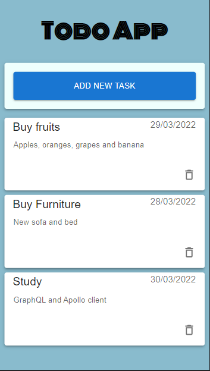
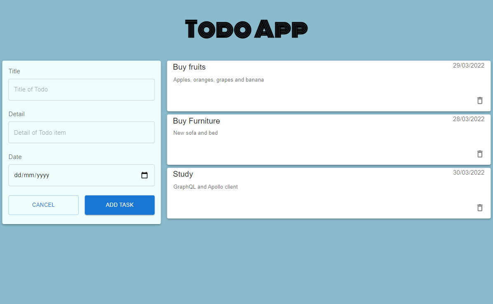

## Todo App 
This is my first app where I did both frontend and backend
### Website
- Website link will be added soon...
### Tools used
- React
- Apollo
- GraphQL
- MongoDB
- Material UI
### Responsive Design
- Responsive design that adapts to different screen sizes
- Example: first picture is for below medium screen sizes and second picture is for above medium screens

### Functionalities
- Getting, adding, updating and deleting tasks
### Things I learned
- Setting up backend using GraphQL, MongoDB and Apollo server
- Using queries and mutations to fetch the data using GraphQL and Apollo client in the frontend
### Things left to do
- Deploy using Heroku
### Feature I want to add in the future
- Adding checkboxes for the todo list and cross out finished task
### Notes
- Followed tutorial from [ckmobile](https://www.youtube.com/watch?v=WkhfTCrBU1E&t=5s&ab_channel=ckmobile) on youtube
- In the tutorial, bootstrap is used for styling. However, I used Material UI and chose a different design for the website
